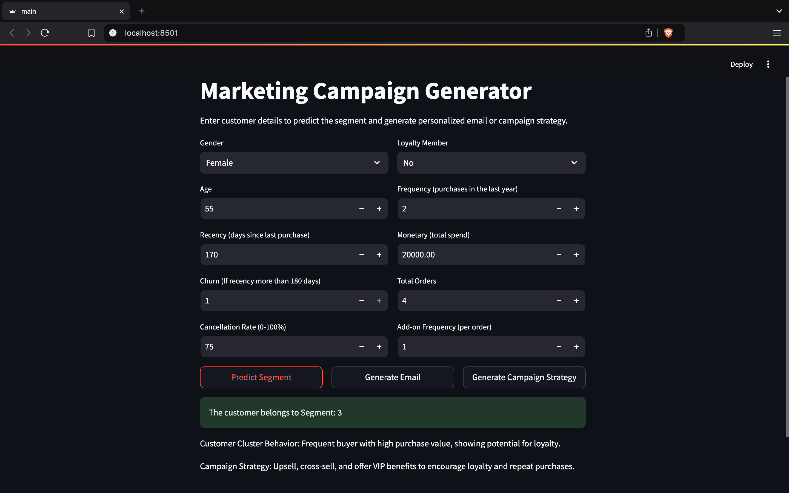
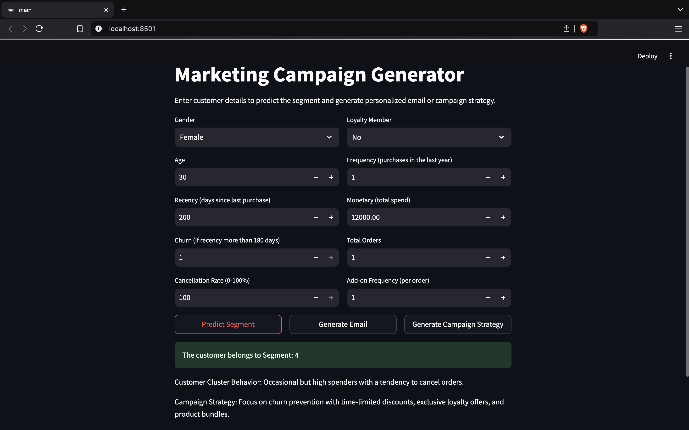
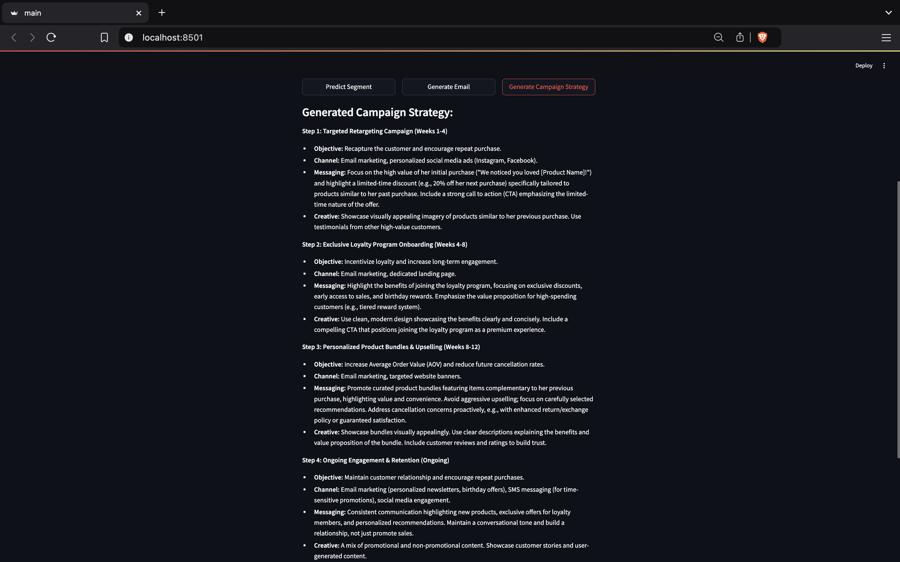
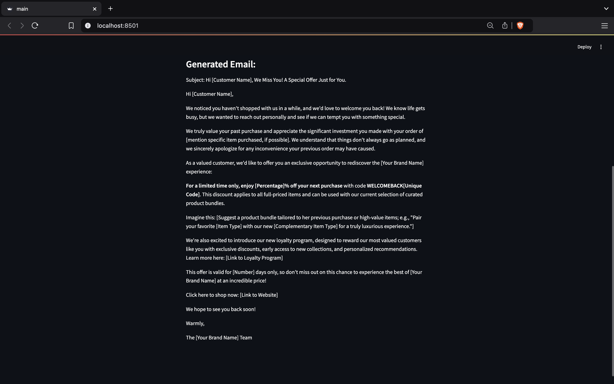

# **AI-Based Personalized Marketing Campaign Generator** 🚀

## **Overview**  
The **AI-Based Personalized Marketing Campaign Generator** is a tool designed to empower marketers by leveraging data-driven insights and AI capabilities. It efficiently segments customers based on demographics and purchasing behaviors, then generates targeted marketing campaigns and personalized emails using **Large Language Models (LLMs)**. 

This tool streamlines the marketing process, ensuring businesses can deliver highly relevant, customer-focused strategies to drive engagement and sales.

## **Key Features** 🌟

- **Data-Driven Customer Segmentation**:  
   Machine learning models cluster customers based on behaviors and demographics, enabling tailored strategies.  
- **Personalized Campaign Generation**:  
   AI-powered content generation provides custom campaigns and emails aligned with each customer segment.  
- **Interactive User Interface**:  
   A interactive UI allows marketers to input customer details and instantly generate results.  

## **Project Workflow** 🛠️

### **1. Exploratory Data Analysis (EDA) & Feature Engineering** 📊  
- **Dataset**: Customer purchase data, including demographics and product information.  
- **EDA**: Data cleaning, visualization, and insightful analysis performed to uncover patterns and trends.  
- **Feature Engineering**: Behavioral features such as **Recency, Frequency, Monetary Value (RFM)**, and **Churn** were crafted to capture customer insights.  

### **2. Machine Learning Modeling** 🤖  
- **Data Preparation**: Scaling and transformation pipelines created using **scikit-learn** for optimal preprocessing.  
- **Model Experimentation**: Multiple models were tested to identify the most effective clustering approach.  
- **Customer Segmentation**:  
   - The optimized **K-Means** model identified **13 distinct customer clusters** with a high silhouette score of **0.42**.  
   - Characteristics for each segment were analyzed to define targeted marketing strategies.  

### **3. LLM Integration** 🧠  
- **Google Gemini 1.5 Flash** (via API) was integrated to generate personalized marketing campaigns and emails.  
- **How it Works**:  
   - Input: Customer cluster characteristics and individual details.  
   - Output: AI-generated, highly targeted **campaign strategies** and **email content**.  

### **4. User Interface** 🎨  
- A sleek and intuitive **Streamlit** interface allows marketers to:  
   - Upload customer data.  
   - Generate personalized marketing strategies.  
   - Generate tailored email content ready for outreach with a few tweeks.

## **Gallery** 📷

### **1. User Interface**


### **2. Predict Segment**


### **3. Generate Strategy**


### **4. Generate Email**



## **How to Run the Project** ▶️  

   ```bash
   git clone https://github.com/varundixit4/Personalised-Marketing-Campaign.git
   cd Personalised-Marketing-Campaign
   pip install -r requirements.txt
   python -m streamlit rum main.py
    
